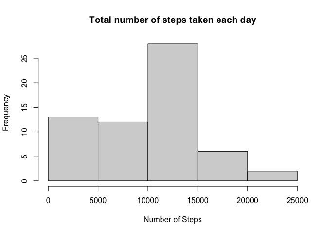
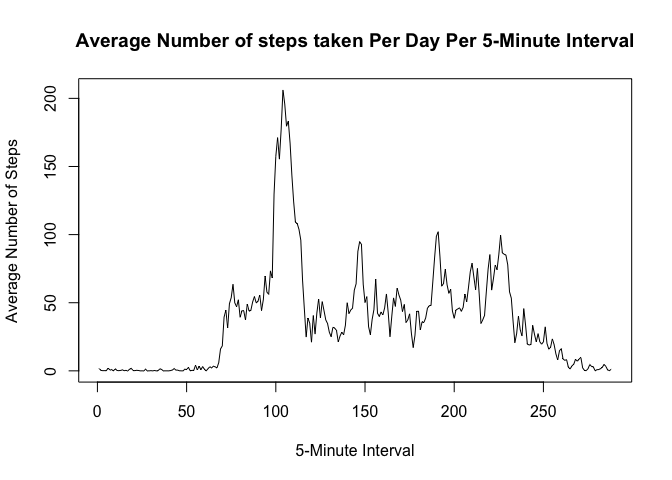
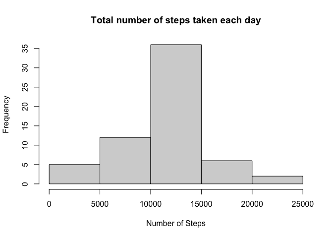
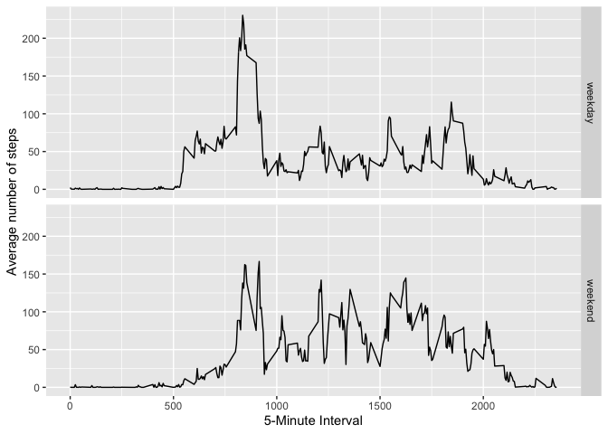

## Loading and preprocessing the data


```r
unzip(zipfile="activity.zip")
activity <-read.csv("activity.csv")
```

## What is mean total number of steps taken per day?


```r
stepsPerDay <-tapply(activity$steps, activity$date, sum, na.rm=TRUE)
stepsPerDay
```

```
## 2012-10-01 2012-10-02 2012-10-03 2012-10-04 2012-10-05 2012-10-06 2012-10-07 
##          0        126      11352      12116      13294      15420      11015 
## 2012-10-08 2012-10-09 2012-10-10 2012-10-11 2012-10-12 2012-10-13 2012-10-14 
##          0      12811       9900      10304      17382      12426      15098 
## 2012-10-15 2012-10-16 2012-10-17 2012-10-18 2012-10-19 2012-10-20 2012-10-21 
##      10139      15084      13452      10056      11829      10395       8821 
## 2012-10-22 2012-10-23 2012-10-24 2012-10-25 2012-10-26 2012-10-27 2012-10-28 
##      13460       8918       8355       2492       6778      10119      11458 
## 2012-10-29 2012-10-30 2012-10-31 2012-11-01 2012-11-02 2012-11-03 2012-11-04 
##       5018       9819      15414          0      10600      10571          0 
## 2012-11-05 2012-11-06 2012-11-07 2012-11-08 2012-11-09 2012-11-10 2012-11-11 
##      10439       8334      12883       3219          0          0      12608 
## 2012-11-12 2012-11-13 2012-11-14 2012-11-15 2012-11-16 2012-11-17 2012-11-18 
##      10765       7336          0         41       5441      14339      15110 
## 2012-11-19 2012-11-20 2012-11-21 2012-11-22 2012-11-23 2012-11-24 2012-11-25 
##       8841       4472      12787      20427      21194      14478      11834 
## 2012-11-26 2012-11-27 2012-11-28 2012-11-29 2012-11-30 
##      11162      13646      10183       7047          0
```


```r
hist(stepsPerDay, xlab="Number of Steps", main="Total number of steps taken each day")
```

<!-- -->


```r
median(stepsPerDay)
```

```
## [1] 10395
```

```r
mean(stepsPerDay)
```

```
## [1] 9354.23
```

The mean and median of the total number of steps taken per day are 9354.23 and 10395, respectively. 


## What is the average daily activity pattern?


```r
averagePerDay <-tapply(activity$steps, activity$interval, mean, na.rm=TRUE)
plot(averagePerDay, xlab="5-Minute Interval", ylab = "Average Number of Steps", type="l", main="Average Number of steps taken Per Day Per 5-Minute Interval")
```

<!-- -->


```r
names(which.max(averagePerDay))
```

```
## [1] "835"
```

The 835th interval contains the maximum number of steps. 

## Imputing missing values


```r
sum(is.na(activity))
```

```
## [1] 2304
```

There are 2304 missing values in the dataset.


```r
meaninterval <-aggregate(steps~interval, activity, FUN=mean)
activityNew <-merge(activity, meaninterval, by="interval")
activityNew$steps <-ifelse(is.na(activityNew$steps.x), activityNew$steps.y, activityNew$steps.x)
activityNew <-activityNew[,c(1,3,5)]
head(activityNew)
```

```
##   interval       date    steps
## 1        0 2012-10-01 1.716981
## 2        0 2012-11-23 0.000000
## 3        0 2012-10-28 0.000000
## 4        0 2012-11-06 0.000000
## 5        0 2012-11-24 0.000000
## 6        0 2012-11-15 0.000000
```

                        


```r
stepsPerDayN <-tapply(activityNew$steps, activityNew$date, sum, na.rm=TRUE)
hist(stepsPerDayN, xlab="Number of Steps", main="Total number of steps taken each day")
```

<!-- -->

```r
median(stepsPerDayN)
```

```
## [1] 10766.19
```

```r
mean(stepsPerDayN)
```

```
## [1] 10766.19
```

The mean and median for the total number of steps taken per day for the new data set are both 10766.19. These are slightly higher than the estiamtes found using the data set with missing values. As the mean was used to imput missing data, using the median or other methods may yield different results. 


## Are there differences in activity patterns between weekdays and weekends?


```r
activityNew$date <-as.Date(activityNew$date)
weekend <- c('Sat', 'Sun')
activityNew$day <- factor((weekdays(activityNew$date, TRUE) %in% weekend), levels=c(FALSE, TRUE), labels=c('weekday', 'weekend'))
head(activityNew)
```

```
##   interval       date    steps     day
## 1        0 2012-10-01 1.716981 weekday
## 2        0 2012-11-23 0.000000 weekday
## 3        0 2012-10-28 0.000000 weekend
## 4        0 2012-11-06 0.000000 weekday
## 5        0 2012-11-24 0.000000 weekend
## 6        0 2012-11-15 0.000000 weekday
```


```r
library(ggplot2)

aggregateData<- aggregate(steps ~ interval + day, data=activityNew, mean)
ggplot(aggregateData, aes(interval, steps)) + 
        geom_line() +
        facet_grid(day ~ .) +
        xlab("5-Minute Interval") + 
        ylab("Average number of steps")
```

<!-- -->

The activity patterns for weekdays and weekends are very smiliar. However, the peak for weekdays is much higher than for the weekend. 
